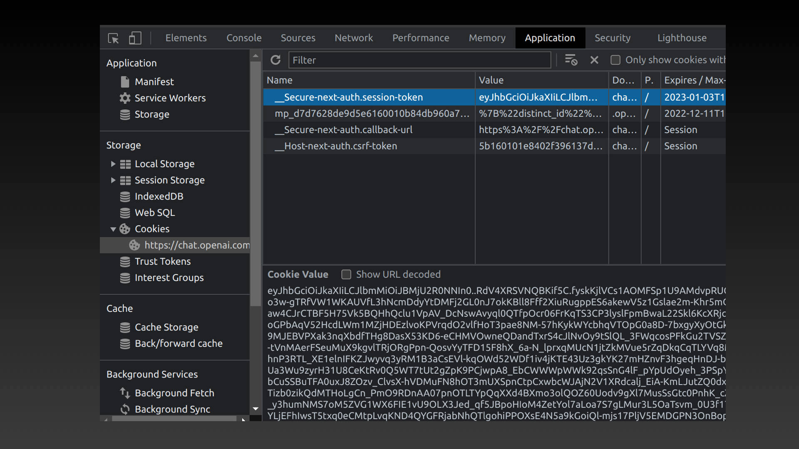
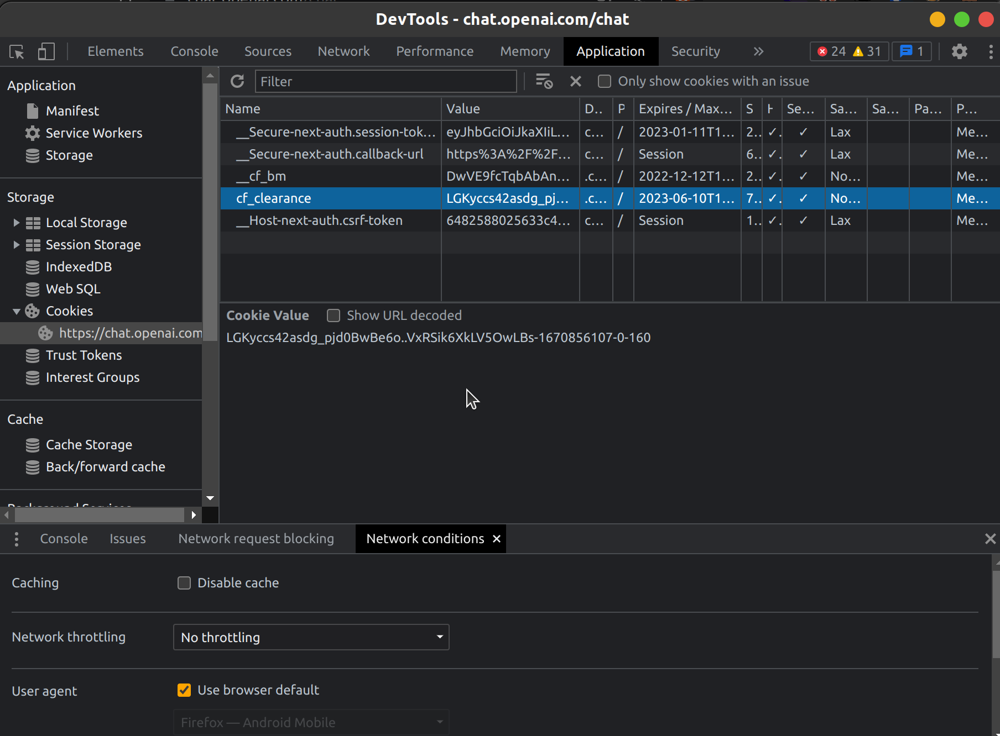
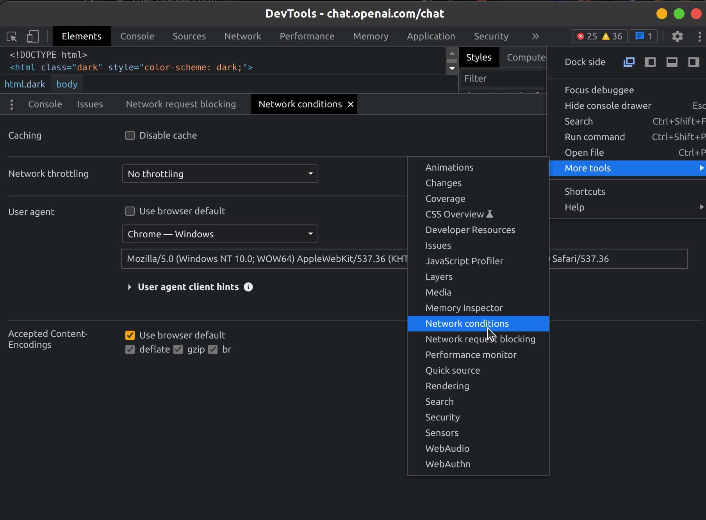

# iChatGPT
OpenAI ChatGPT app for  iOS, iPadOS, macoS

###  一、App 介绍

使用和原理介绍：
- [用 SwiftUI 实现 AI 聊天对话 app - iChatGPT](https://juejin.cn/post/7175051294808211512)

**更新说明**

目前 v1.1.1:
- Cloudflare cookie support

**支持功能**

实现 ChatGPT 基本聊天功能：

* 可以直接与 ChatGPT 对话，并且保留上下文；
* 可以复制问题和回答内容；
* 可以快捷重复提问;
* iPadOS 和 macOS 可以同时打开多个独立的聊天对话

支持系统：
* iOS 14.0+
* iPadOS 14.0+
* macOS 11.0+

**TODO**

* 保存对话
* ~~显示个人头像~~
* 代码没有高亮
* ~~请求失败重试等~~
* 更多功能，欢迎提 PR ~

### 二、安装说明

#### 2.1 macSO 安装包下载

- [Releases](https://github.com/37iOS/iChatGPT/releases)

> 注：
> 1. iOS 和 iPadOS 需要自行编译安装，暂时不提供安装包。

#### 2.2 Xcode 构建

- 构建依赖：Xcode14

下载项目后，双击 `iChatGPT.xcodeproj` 打开项目构建。

> 注：依赖其它组件，需要保证能访问 GitHub 服务。

### 三、FAQ

#### 3.1 登陆

**目前只支持 ChatGPT Session Token 登陆**

获取 SessionToken 的方法很多，比如抓包，而浏览器方法最简单：

- 登录 [chat.openai.com/chat](https://chat.openai.com/chat)
- 按 `F12` 打开控制台（macOS 可以用快捷键 `command + option + I` ）
- 切换到 `Application`(应用) 选项卡，找到 `Cookies` （Safari 浏览器是 储存空间 选项卡）
- 复制 `__Secure-next-auth.session-token` 的值：

- 复制 `cf_clearance` 值：

- 复制 `user_agent` 值：

然后在 App 右上角图标，添加参考密钥，点击保存就可以正常使用：

**ChatGPT 账号和密码登陆**

账号和密码登陆方式也有临时解决方案  [rawandahmad698/PyChatGPT](https://github.com/rawandahmad698/PyChatGPT/blob/955883864e35d9aadcfd9c1ba9f6f4e7ae845672/src/pychatgpt/classes/openai.py#L73)，但测试发现异常网络需要验证码，所以暂未实现账号和密码登陆。

欢迎大家提 PR ! 或者有解决方案欢迎大家提供~

#### 3.2 启动 macOS app

- 问题：首次打开提示：“无法打开iChatGPT.app”，因为 Apple 无法检查其是否包含恶意软件。”
> 解决方法：选中 app 后，点击右键 -> ”打开“，即可正常打开 iChatGPT。

#### 3.3 More Questions

- [New Issue](https://github.com/37iOS/iChatGPT/issues/new/choose)

### 四、效果示例

### 五、特别鸣谢

- [OpenAI ChatGPT](https://chat.openai.com/)
- [OpenAI Blog](https://openai.com/blog/)
- [A-kirami/nonebot-plugin-chatgpt](https://github.com/A-kirami/nonebot-plugin-chatgpt)
- [shaps80/MarkdownText](https://github.com/shaps80/MarkdownText)
