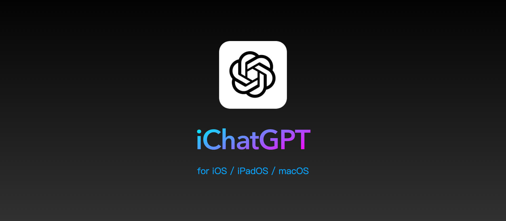
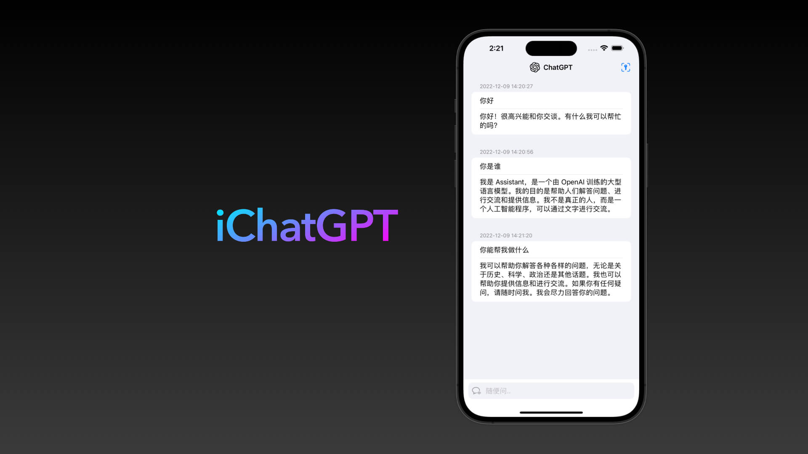
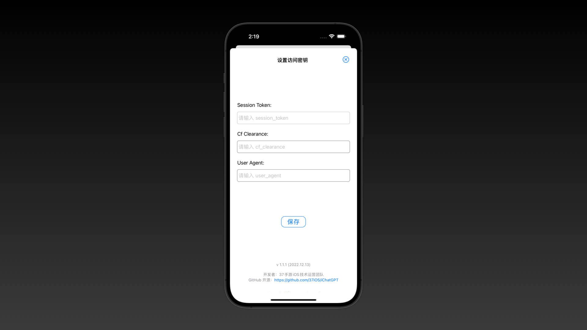
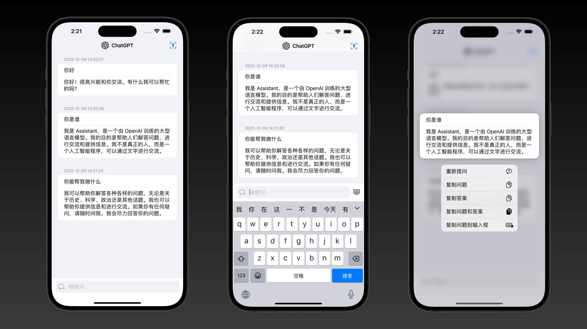
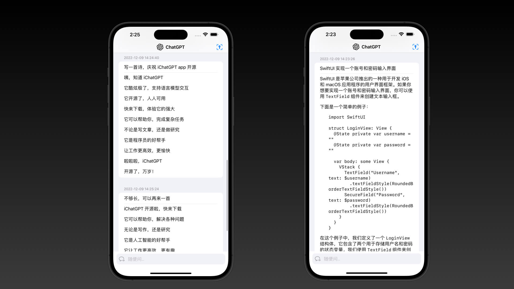
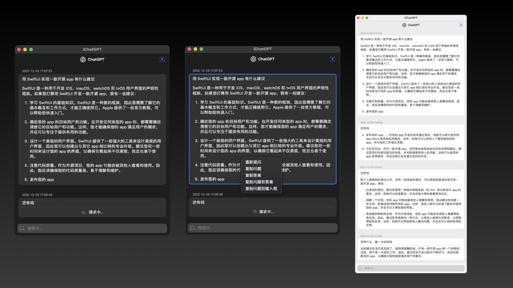

# iChatGPT
OpenAI ChatGPT app for  iOS, iPadOS, macoS

###  一、App 介绍

使用和原理介绍：
- [用 SwiftUI 实现 AI 聊天对话 app - iChatGPT](https://juejin.cn/post/7175051294808211512)

#### 更新说明

最新版本 v2.7

- Streamlined output support. (支持流式输出)
- Added modules for gpt-3.5-turbo-16k, gpt-3.5-turbo-16k-061, and gpt-4-32k-0613. (增加模块，支持 gpt-3.5-turbo-16k、gpt-3.5-turbo-16k-061 和 gpt-4-32k-0613)
- Increased request timeout to 60 seconds to reduce timeout issues. (请求超时时间调整为 60 秒，减少请求超时问题)
- Switched to historical conversations, automatically scrolling to the latest content. (切换历史对话，默认滚动到最新的对话内容)
- Optimized several user experience details. (优化一些体验细节)

**支持功能**

实现 ChatGPT 基本聊天功能：

* 可以直接与 ChatGPT 对话，并且保留上下文；
* 可以复制问题和回答内容；
* 可以快捷重复提问;
* iPadOS 和 macOS 可以同时打开多个独立的聊天对话

支持系统：
* iOS 14.0+
* iPadOS 14.0+
* macOS 11.0+

**TODO**

* ~~显示个人头像~~
* ~~请求失败重试等~~
* ~~支持多语言，如英文~~
* ~~保存对话~~
* ~~保存 pdf 文件~~
* ~~支持自定义 API URL~~
* 自由的选择和复制文本
* 支持语音输入
* 支持代码高亮和复制等
* 支持表格显示
* 支持流式输出
* 支持自定义图标
* 悬浮窗模式
* 更多功能，欢迎提 PR ~

### 二、安装说明

#### 2.1 iOS / iPadOS / Mac Apple Silicon

- iOS 14.0+
- iPadOS 14.0+
- macOS 11.0+（Mac Apple Silicon M1/M2+）

TestFlight 下载地址：[https://testflight.apple.com/join/GR4BOt2M](https://testflight.apple.com/join/GR4BOt2M)

> 注：
> 1. TestFlight 名额有限，先下先得！
> 2. 如无名额，iOS 和 iPadOS 需要自行编译安装。

#### 2.2 macSO 安装包下载

- macOS 11.0+
- Mac Apple Silicon M1/M2+
- Mac Intel x86_64

- Mac 下载：[Releases](https://github.com/37MobileTeam/iChatGPT/releases)

#### 2.3 Xcode 构建

- 构建依赖：Xcode14

下载项目后，双击 `iChatGPT.xcodeproj` 打开项目构建。

> 注：依赖其它共享组件，需要保证能访问 GitHub 服务。

### 三、FAQ

#### 3.1 登陆

**目前支持使用openai key来进行认证，无需其他方式**

欢迎大家提 PR ! 或者有解决方案欢迎大家提供~

#### 3.2 启动 macOS app

- 问题：首次打开提示：“无法打开iChatGPT.app”，因为 Apple 无法检查其是否包含恶意软件。”
> 解决方法：选中 app 后，点击右键 -> ”打开“，即可正常打开 iChatGPT。

#### 3.3 More Questions

- [New Issue](https://github.com/37MobileTeam/iChatGPT/issues/new/choose)

#### 3.4 历史更新功能

**v2.6:**
- Support custom API URL.（支持自定义 API URL。）
- Set API timeout duration.（设置 API 超时时间。）
- Configure API model for individual chat rooms.（支持聊天室单独设置 API 模型。）
- Support more model choices (e.g., gpt-4-32k).（支持更多模型选择，如 gpt-4-32k 等。）
- Change icons to local images and differentiate gpt-4 icons.（将图标更改为本地图片并区分 gpt-4 图标。）
- Fix auto letter conversion issue with consecutive characters (e.g., in Chinese or Japanese).（修复连续输入字符时自动变为字母的问题，如中文或日文。）

**v2.5:**
- Added chat room settings with Prompt and Temperature parameter configuration. (新增聊天室设置功能，支持 Prompt 和 Temperature 参数配置。)
- Display current conversation identifier in the history list. (历史对话列表增加显示当前对话标识。)
- Fixed potential crash when sending conversations. (修复发送对话时可能会崩溃的问题。)
- Removed restrictions on creating new conversations and switching history when requesting a conversation. (请求对话时，取消创建新对话和切换历史对话的禁用限制。)
- Improved multi-language translations for sharing feature. (完善分享功能的多语言翻译。)

**v2.4:**
- Add sharing function（增加分享功能）
- Fix the history list is too high（修复历史列表过高）

**v2.3:**
- Create new conversation. (创建新的对话)
- Save conversation records. (保存对话记录)
- Switch to historical conversations. (切换历史对话)
- Scroll to the top of the conversation list. (滚动到对话列表的顶部)
- Auto-scroll to the bottom of the conversation list. (自动滚动到对话列表的底部)
- Option to request conversations without historical records (click on the icon on the left side of the input box to toggle). (请求时可不带历史对话记录)
- Support for additional languages (Traditional Chinese, Korean, Japanese, French, German, Russian, etc.). (支持更多语言（繁体中文、韩文、日文、法语、德语、俄语等）)

**v2.2:**
- Increased request timeout from 30 seconds to 60 seconds.（请求超时从 30 秒增加到 60 秒。）
- When sending dialog context, only send the first three Q&A rounds, and submit only the first 100 characters of the answer.（发送对话上下文时，只发送提问的前三轮问答，且答案只提交前100个字。）
- Fixed Chinese Pinyin input method typing interruption problem (thanks to @ypwhs/@coder-free/@0xfeedface1993).(修复中文拼音输入法打字中断的问题（感谢 @ypwhs、@coder-free、@0xfeedface1993）)

**v2.1:**
- support GPT-4 Model（支持 GPT-4 模型）
- support English language（支持英文语言）
- display configured API Key（显示已配置的 API Key）

**v2.0:**
- support OpenAI API key
- base GPT3.5 Turbo

> 注意：需要填写自己的 OpenAI API key，app 不提供 key！ 

### 四、Contributors 

* [@iHTCboy](https://github.com/iHTCboy) 
* [@AlphaGogoo (BWQ)](https://github.com/AlphaGogoo)
* [@RbBtSn0w (Snow Wu)](https://github.com/RbBtSn0w)
* [@0xfeedface1993 (John Corner)](https://github.com/0xfeedface1993)

### 五、效果示例

### 六、特别鸣谢

- [Chat completion - OpenAI API](https://platform.openai.com/docs/guides/chat)
- [Models - OpenAI API](https://platform.openai.com/docs/models/moderation)
- [OpenAI ChatGPT](https://chat.openai.com/)
- [OpenAI Blog](https://openai.com/blog/)
- [A-kirami/nonebot-plugin-chatgpt](https://github.com/A-kirami/nonebot-plugin-chatgpt)
- [shaps80/MarkdownText](https://github.com/shaps80/MarkdownText)
- [MacPaw/OpenAI](https://github.com/MacPaw/OpenAI)
- [SwiftUIX/SwiftUIX](https://github.com/SwiftUIX/SwiftUIX)
